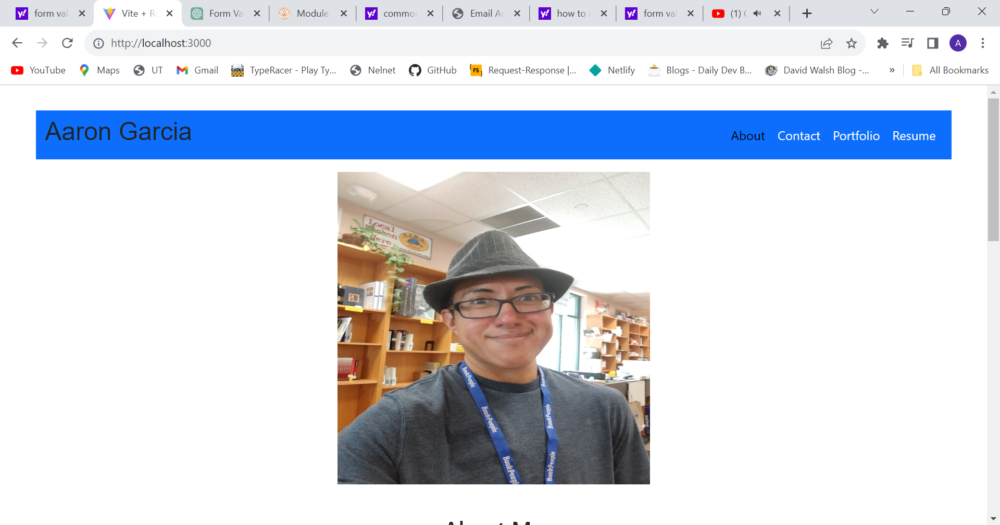
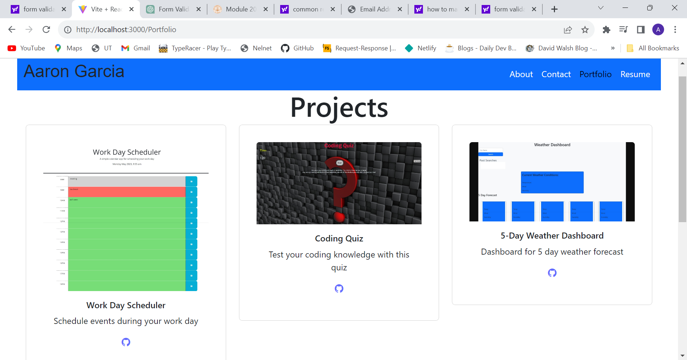

  

# AG-Portfolio

## Description
Professional Portfolio using React (vite)

## Table of Contents
- [Installation](#Installation)
- [Usage](#Usage)
- [Credits](#Credits)
- [License](#License)
- [Contributors](#Contributing)
- [Tests](#Tests)
- [Questions](#Questions)

## Installation
None needed
  
## Usage 
This webpage will allow prospective employers to view info about me, my projects and contact me if desired.

## Credits 
*Logic for array in Project page was from user njthanhtrang (https://github.com/njthanhtrang)
*Logic for downloading PDF is from Code Pro on youtube, channel is https://www.youtube.com/channel/UCNVKOc0Ya-MVHElzxT7htxw
*Logic for Form validation is from Code with Yousaf on youtube, channel is https://www.youtube.com/channel/UCZyFxfw1M44QyjRv751MlGg
*Got router logic and other basic setups from the class examples in the React module as well as advice from Kevin Long.

## License 
For more info, please visit: [License Link](https://opensource.org/licenses/MIT)

## Contributing
Feel free to help me make the look and feel better, also help with mobile functionality

## Tests 
N/A

## Questions 
If you have any questions you can find me at [SilvAG6271](https://github.com/SilvAG6271) and <a href="mailto:auron7985@gmail.com">auron7985@gmail.com</a>.
